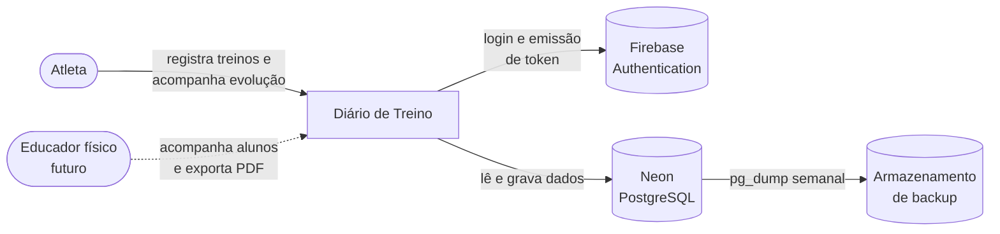
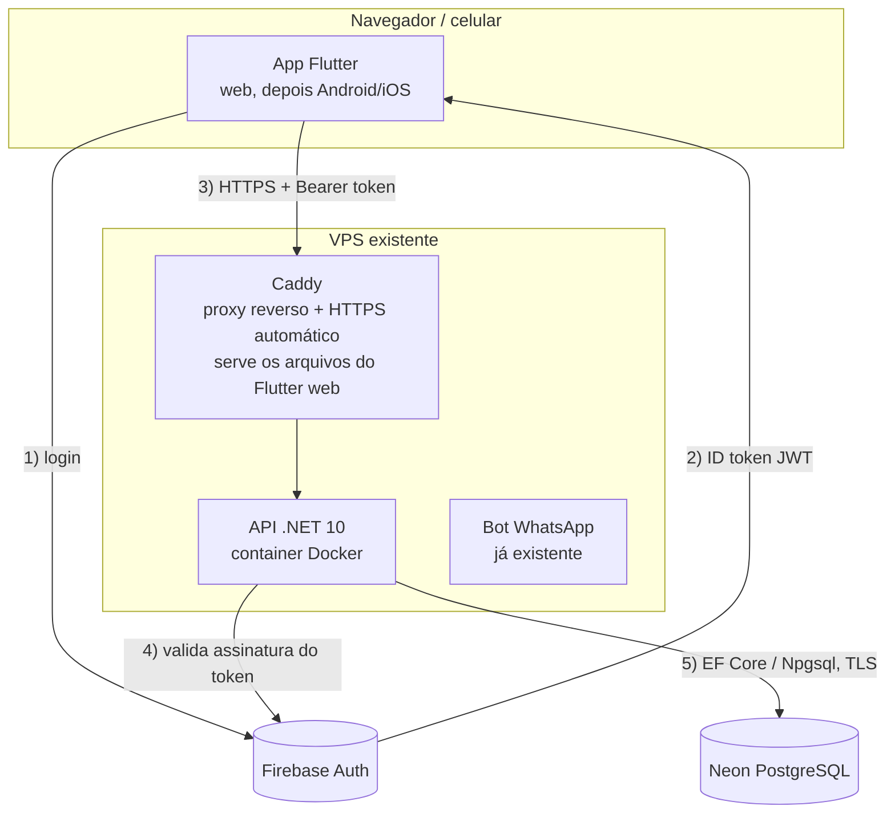
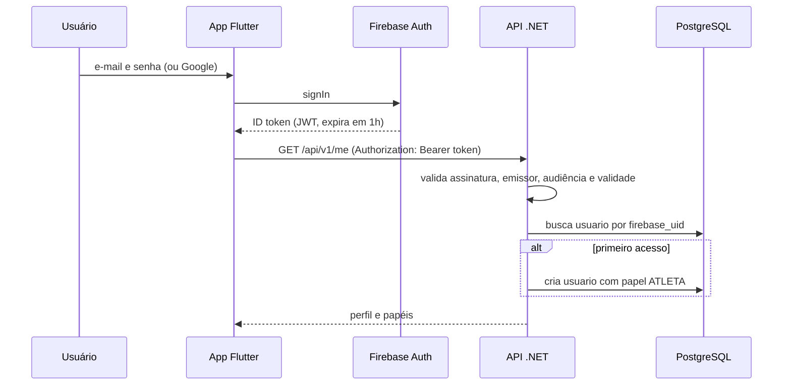
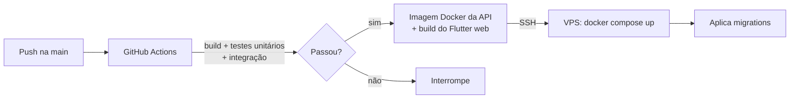

# MAS: Modelo de Arquitetura de Software

**Projeto:** Diário de Treino (nome provisório)
**Versão:** 0.1 (antes do início do desenvolvimento)
**Documentos relacionados:** [MER.md](MER.md), [README.md](../README.md)

---

## 1. Objetivo do documento

Registrar as decisões de arquitetura do aplicativo antes do desenvolvimento, para que qualquer pessoa (ou o Kiro) consiga implementar uma PBI sem reabrir discussões já fechadas. Toda decisão nova ou alterada deve ser refletida aqui.

## 2. Visão do produto em uma frase

Aplicativo para registrar treinos (inclusive dias depois do fato) e acompanhar a evolução por exercício, com a observação do dia explicando os pontos fora da curva. Nasce para uso pessoal do atleta, com a estrutura preparada para um educador físico acompanhar os próprios alunos.

## 3. Escopo arquitetural

| Dentro do MVP | Preparado na estrutura, sem tela | Fora (incrementos futuros) |
|---|---|---|
| Login e cadastro | Papel de educador | Telas do modo educador |
| Fichas A/B/C com exercícios | Vínculo educador x aluno | Exportação em PDF |
| Registro da sessão por série, com carga pré-preenchida | Prescrito x executado | Modo corrida por zonas (trechos) |
| Observação do dia | Intensidade e volume genéricos | Importação do relógio/Strava |
| Gráfico de evolução por exercício com filtro de período | | Apps nas lojas (Android/iOS) |

## 4. Requisitos que guiam a arquitetura

### 4.1 Funcionais (macro)

- RF01: o usuário se cadastra e entra com e-mail e senha ou conta Google.
- RF02: o atleta monta fichas (A, B, C...) com exercícios, séries e alvos.
- RF03: o atleta registra uma sessão em qualquer data, com séries pré-preenchidas pela última execução de cada exercício.
- RF04: cada série guarda intensidade (carga, zona, peso corporal) e volume (repetições, tempo, distância).
- RF05: a sessão tem campo de observação livre.
- RF06: o atleta vê a evolução por exercício em gráfico, filtrando 10, 15, 30 dias ou período livre, e abre a observação do dia ao tocar num ponto.
- RF07 (futuro): educador com vínculo ativo vê treino e progresso do aluno e exporta em PDF.

### 4.2 Não funcionais

| Atributo | Requisito | Como a arquitetura atende |
|---|---|---|
| Custo | Até R$ 30/mês, dividido entre os sócios | Banco no plano gratuito do Neon, Firebase Auth gratuito para e-mail e Google, API na VPS já existente |
| Durabilidade | O histórico não pode se perder nunca | Banco gerenciado fora da VPS + `pg_dump` semanal guardado em outro local |
| Segurança | Um usuário nunca vê dado de outro sem vínculo | Regra única de autorização na API, testada |
| Privacidade (LGPD) | Observação pode conter dado de saúde | Acesso só pelo dono e educador vinculado; consentimento antes do modo educador |
| Portabilidade | Web primeiro, lojas depois | Flutter com o mesmo código para web e mobile |
| Manutenibilidade | Dois desenvolvedores em tempo parcial | Monólito em camadas, sem microsserviços, migrations versionadas |
| Disponibilidade | Uso pessoal, sem SLA | Aceita hibernação do banco e reinício da API; sem alta disponibilidade |

## 5. Restrições e premissas

- Back-end em .NET 10 (LTS), front-end em Flutter.
- Banco relacional PostgreSQL; login pelo Firebase Authentication.
- Hospedagem da API na VPS em que já roda o bot de WhatsApp.
- O MVP é usado online. Registro offline não é requisito, porque o fluxo combinado é anotar na academia e alimentar depois.
- Desenvolvimento assistido pelo Kiro; este documento e o MER servem de contexto (steering) para ele.

## 6. Decisões de arquitetura

Cada decisão segue o formato curto de ADR: contexto, decisão e consequência.

### ADR-01: Monólito em camadas, não microsserviços
- **Contexto:** dois desenvolvedores, domínio pequeno, orçamento mínimo.
- **Decisão:** uma única API .NET organizada em camadas (seção 8).
- **Consequência:** um deploy, um banco, depuração simples. Se um módulo crescer muito, as fronteiras das camadas permitem extrair depois.

### ADR-02: PostgreSQL em vez de Firestore
- **Contexto:** o modelo é relacional (vínculos, plano, sessão, séries) e o feedback depende de agregações por período.
- **Decisão:** PostgreSQL acessado via EF Core com o provider Npgsql.
- **Consequência:** consultas de evolução viram SQL simples; migrations versionadas no repositório. Perde-se o acesso direto do app ao banco, que não seria usado de qualquer forma, já que existe API.

### ADR-03: Neon (plano gratuito) como hospedagem do banco
- **Contexto:** volume previsto de poucos MB por ano; VPS barata e compartilhada com o bot.
- **Decisão:** Postgres no Neon, plano gratuito. Backup próprio semanal via `pg_dump`.
- **Consequência:** custo zero e dados fora da VPS. O banco hiberna após 5 minutos sem uso, então a primeira requisição depois de um tempo parado é mais lenta. Aceito para o uso previsto.

### ADR-04: Firebase Authentication para identidade, autorização no nosso banco
- **Contexto:** não queremos guardar senha nem implementar recuperação de conta.
- **Decisão:** o Firebase autentica e emite o token (JWT). A API valida o token e resolve papéis e vínculos no Postgres. Custom claims do Firebase não são usadas para regra de negócio.
- **Consequência:** trocar de provedor de login no futuro afeta só a validação do token. Toda regra de acesso fica num lugar só, testável.

### ADR-05: Prescrito separado do executado
- **Contexto:** o educador vai querer comparar planejado com realizado, e a execução pode fugir do plano.
- **Decisão:** a ficha guarda o prescrito (`treino_exercicio`, `etapa_prescrita`); a sessão guarda o executado (`serie_executada`). O plano apenas pré-preenche a tela.
- **Consequência:** a sessão pode existir sem ficha (treino montado na hora) e alterar o plano nunca altera o histórico.

### ADR-06: Toda série tem intensidade e volume
- **Contexto:** musculação, isometria, corrida e reabilitação medem coisas diferentes.
- **Decisão:** cada série guarda um par (métrica de intensidade, valor) e (métrica de volume, valor), com métricas vindas de uma tabela fixa.
- **Consequência:** um modelo único atende todas as modalidades, e os gráficos conseguem agrupar porque a métrica nunca é texto livre.

### ADR-07: Flutter web primeiro, com semântica habilitada
- **Contexto:** publicar na Apple Store custa caro e só compensa se houver venda; testes E2E serão em Robot Framework.
- **Decisão:** publicar primeiro como web. Habilitar a árvore de semântica do Flutter (`SemanticsBinding.instance.ensureSemantics()`) e dar rótulo a todo campo e botão.
- **Consequência:** o Flutter web desenha em canvas; sem semântica, o Robot não encontra elementos no DOM. Com ela, os testes ficam estáveis e o app ganha acessibilidade de brinde.

### ADR-08: Tema claro e escuro no mesmo app
- **Contexto:** o cliente aprovou as opções A (clara) e B (escura) e quer as duas.
- **Decisão:** dois temas com a mesma estrutura de telas. Padrão "seguir o sistema" do celular, com troca manual por um botão na tela inicial e uma opção em Perfil (Sistema, Claro, Escuro). A escolha fica salva no aparelho.
- **Consequência:** nenhuma cor é escrita direto nas telas; tudo vem de tokens de tema (`ThemeData` claro e escuro + `ThemeExtension` para cores próprias, como a de observação). Cada componente precisa ser conferido nos dois temas, inclusive o contraste mínimo de texto.

## 7. Visão de contexto (C4 nível 1)



## 8. Visão de containers (C4 nível 2)



| Container | Tecnologia | Responsabilidade |
|---|---|---|
| App | Flutter (Dart) | Telas, navegação, estado local, chamadas à API |
| Proxy | Caddy | TLS automático, roteamento por domínio, arquivos estáticos do app web |
| API | ASP.NET Core 10, Minimal APIs | Regras de negócio, autorização, persistência |
| Banco | PostgreSQL (Neon) | Dados do domínio |
| Identidade | Firebase Authentication | Cadastro, login, recuperação de senha, emissão de token |

## 9. Visão lógica do back-end

### 9.1 Estrutura da solução

```
src/
  DiarioTreino.Domain/          entidades, enums, regras puras (sem dependência externa)
  DiarioTreino.Application/     casos de uso, DTOs, interfaces de repositório, validações
  DiarioTreino.Infrastructure/  EF Core, DbContext, migrations, repositórios, integração Firebase
  DiarioTreino.Api/             endpoints, autenticação, middlewares, injeção de dependência
tests/
  DiarioTreino.UnitTests/         xUnit: domínio e casos de uso
  DiarioTreino.IntegrationTests/  xUnit + Testcontainers (Postgres real) + WebApplicationFactory
e2e/
  robot/                          Robot Framework + Browser library contra o app web
```

Regra de dependência: `Api → Application → Domain` e `Infrastructure → Application`. O domínio não conhece EF Core, Firebase nem HTTP.

### 9.2 Módulos de domínio

| Módulo | Entidades | Casos de uso principais |
|---|---|---|
| Identidade | Usuario, UsuarioPapel | Provisionar usuário no primeiro acesso, consultar perfil |
| Vínculos (futuro) | Vinculo | Convidar aluno, aceitar, encerrar |
| Catálogo | Exercicio, Metrica | Listar catálogo global + exercícios próprios, criar exercício |
| Planejamento | PlanoTreino, Treino, TreinoExercicio, EtapaPrescrita | Montar e editar fichas |
| Execução | Sessao, SerieExecutada | Abrir sessão pré-preenchida, salvar sessão, editar sessão |
| Progresso | (consultas) | Evolução por exercício, resumo do período, sessões do período |

### 9.3 Bibliotecas de referência

| Necessidade | Escolha |
|---|---|
| ORM | Entity Framework Core + Npgsql |
| Validação de entrada | FluentValidation |
| Logs | Serilog (console estruturado) |
| Documentação da API | OpenAPI nativo do ASP.NET Core |
| Testes | xUnit, Testcontainers, WebApplicationFactory |

## 10. Visão lógica do front-end

```
lib/
  core/          cliente HTTP (Dio), interceptor do token, tema, rotas (go_router)
  features/
    auth/        login, cadastro
    inicio/      tela inicial, próximo treino
    fichas/      montar e editar fichas
    sessao/      registrar treino
    progresso/   gráficos e filtros
  shared/        componentes reutilizáveis
  theme/         tokens de cor e tipografia dos temas claro e escuro
```

| Necessidade | Escolha |
|---|---|
| Estado | Riverpod |
| Navegação | go_router |
| HTTP | Dio, com interceptor que anexa o ID token do Firebase e renova quando expira |
| Login | firebase_auth |
| Gráficos | fl_chart |
| Tema | `ThemeMode` (sistema, claro, escuro) persistido com shared_preferences |

Organização por funcionalidade (feature-first): cada pasta de `features` tem suas telas, estado e chamadas, o que casa uma PBI com uma pasta.

## 11. Autenticação e autorização

### 11.1 Fluxo



### 11.2 Configuração da validação do token

- Esquema JWT Bearer padrão do ASP.NET Core.
- Authority: `https://securetoken.google.com/<id-do-projeto-firebase>`.
- Emissor válido: o mesmo endereço; audiência válida: o id do projeto.
- Nenhuma chave secreta guardada na API: as chaves públicas do Google são obtidas automaticamente.

### 11.3 Regra única de autorização

Toda leitura ou escrita de dados de um atleta passa por um único serviço:

```
PodeAcessarAtleta(usuarioLogado, atletaId) =
    usuarioLogado.Id == atletaId
    OU existe vinculo(educador = usuarioLogado, aluno = atletaId, status = ATIVO)
```

- Implementado como serviço de aplicação (`IControleAcesso`) chamado pelos casos de uso, nunca reescrito em endpoint.
- Coberto por testes unitários e de integração com os cenários: dono, educador com vínculo ativo, educador com vínculo encerrado, terceiro sem vínculo.
- Escrita de ficha por educador (futuro) exige vínculo ativo e grava o educador como `autor_id` do plano.
- Recurso de outro usuário responde 404, não 403, para não revelar que o recurso existe.

## 12. Contrato da API (v1)

Prefixo `/api/v1`, JSON, datas em ISO 8601, ids em UUID. Erros no formato Problem Details (RFC 9457).

| Método | Rota | Descrição | Incremento |
|---|---|---|---|
| GET | `/me` | Perfil e papéis do usuário logado (provisiona no primeiro acesso) | 1 |
| GET | `/metricas` | Métricas disponíveis | 1 |
| GET | `/exercicios?busca=` | Catálogo global + exercícios do usuário | 1 |
| POST | `/exercicios` | Cria exercício próprio | 1 |
| GET | `/planos/ativo` | Plano ativo com fichas e exercícios | 1 |
| POST | `/planos` | Cria plano | 1 |
| POST | `/planos/{id}/treinos` | Adiciona ficha | 1 |
| PUT | `/treinos/{id}` | Edita ficha (nome, exercícios, ordem, alvos) | 1 |
| DELETE | `/treinos/{id}` | Arquiva ficha | 1 |
| GET | `/treinos/{id}/rascunho-sessao` | Sessão pré-preenchida com a última execução | 1 |
| POST | `/sessoes` | Salva sessão com séries | 1 |
| GET | `/sessoes/{id}` | Detalhe da sessão | 1 |
| PUT | `/sessoes/{id}` | Edita sessão | 1 |
| DELETE | `/sessoes/{id}` | Exclui sessão | 1 |
| GET | `/sessoes?de=&ate=` | Sessões do período | 1 |
| GET | `/progresso/exercicios/{id}?de=&ate=` | Série temporal do exercício com observações | 1 |
| GET | `/progresso/resumo?de=&ate=` | Contagem de treinos e sessões de cardio | 2 |
| GET | `/alunos` | Alunos com vínculo ativo | Futuro |
| POST | `/vinculos` | Convida aluno | Futuro |
| GET | `/alunos/{id}/progresso/pdf?de=&ate=` | Relatório em PDF | Futuro |

Rotas de dados de atleta aceitam `atletaId` opcional na query para o educador; sem ele, vale o usuário logado. A regra da seção 11.3 é aplicada sempre.

## 13. Dados

- Modelo completo, dicionário de dados e índices: [MER.md](MER.md).
- Migrations do EF Core versionadas no repositório e aplicadas no deploy.
- Banco de desenvolvimento local em Docker; banco de produção no Neon.
- Backup: `pg_dump` semanal automatizado (job agendado na VPS), guardado fora da VPS e do Neon, com teste de restauração a cada trimestre.

## 14. Implantação



- `docker-compose.yml` na VPS com os serviços `caddy` e `api`, separados do compose do bot.
- Configurações sensíveis (string de conexão, id do projeto Firebase) em variáveis de ambiente, nunca no repositório.
- Ambientes: `local` (Docker) e `producao`. Um ambiente de homologação só se surgir necessidade.
- Health check em `/health`, usado pelo Docker para reiniciar a API se ela travar.

## 15. Qualidade e testes

| Nível | Ferramenta | O que cobre |
|---|---|---|
| Unitário | xUnit | Regras de domínio, controle de acesso, cálculo de pré-preenchimento |
| Integração | xUnit + Testcontainers + WebApplicationFactory | Endpoints com Postgres real e token falso assinado localmente |
| E2E | Robot Framework + Browser library | Fluxo principal no app web: entrar, registrar treino, ver no gráfico |
| Front | flutter_test | Widgets críticos (formulário de série, filtro de período) |

Definition of Done mínima de uma PBI: critérios de aceite atendidos, testes do nível adequado passando no CI, migration criada quando houver mudança de banco, este documento atualizado se alguma decisão mudou.

## 16. Segurança e LGPD

- HTTPS obrigatório (Caddy) e conexão TLS com o banco.
- Sem senha armazenada pela aplicação.
- CORS restrito ao domínio do app.
- Logs nunca registram token nem texto de observação.
- Exclusão de conta remove os dados do usuário no banco e no Firebase.
- Antes do modo educador: termo de consentimento cobrindo acesso do educador às observações e exportação em PDF.

## 17. Observabilidade

- Logs estruturados em console (Serilog), lidos via `docker logs`.
- Identificador de correlação por requisição.
- Endpoint `/health` checando API e conexão com o banco.

## 18. Riscos e pontos em aberto

| Risco ou dúvida | Impacto | Tratamento |
|---|---|---|
| VPS sobrecarregada com bot + API | Lentidão ou queda | Monitorar memória; mover a API se necessário |
| Hibernação do Neon | Primeira requisição lenta | Aceito; reavaliar se incomodar no uso real |
| Mudança nos limites do plano gratuito do Neon | Custo inesperado | Backup próprio permite migrar de provedor |
| Definição de zona (FC, pace ou percepção) | Afeta modelo do modo corrida | Pergunta enviada ao Vinicius |
| Privacidade das observações frente ao educador | Afeta regra de acesso | Decidir antes do modo educador |
| Métrica do gráfico (maior carga ou volume) | Afeta consulta de progresso | Validar com o Vinicius antes da PBI de progresso |

## 19. Evolução prevista

1. Incremento 2: cardio como exercício de modalidade CARDIO (zona x tempo ou distância) e resumo do período.
2. Modo educador: telas de vínculo, visão do aluno, exportação em PDF gerada a partir da mesma consulta do progresso.
3. Modo corrida por zonas: trechos com esforço e recuperação, feedback por tempo em zona.
4. Importação de arquivo do relógio ou Strava.
5. Publicação nas lojas.
