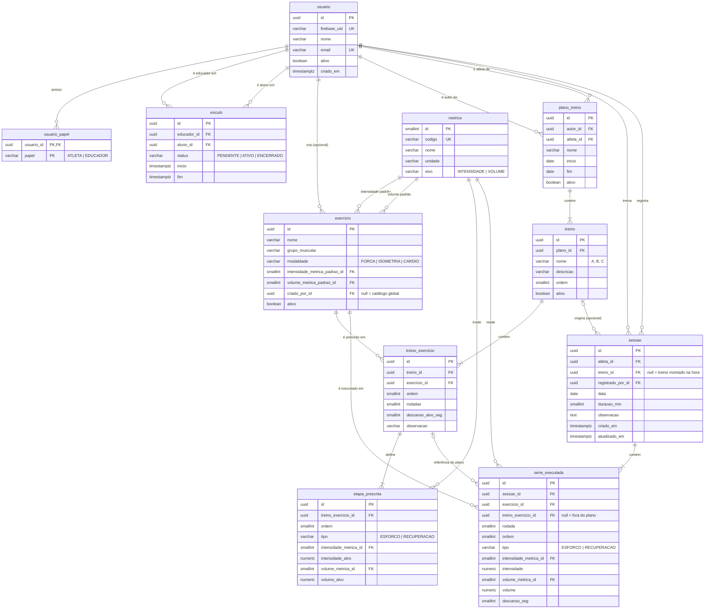

# MER: Modelo Entidade-Relacionamento

**Projeto:** Diário de Treino (nome provisório)
**Versão:** 0.1
**Banco:** PostgreSQL
**Documentos relacionados:** [MAS.md](MAS.md)

---

## 1. Convenções

- Tabelas e colunas em `snake_case`, no singular.
- Chave primária `id` do tipo `uuid` (gerada pela aplicação), exceto `metrica`, que é tabela de referência com `smallint`.
- Datas com hora em `timestamptz` (UTC); data do treino em `date`, porque o usuário informa o dia, não o instante.
- Enums guardados como `varchar` com `CHECK`, para leitura direta no banco e migração simples.
- Valores medidos em `numeric(9,2)`.
- Toda tabela de domínio tem `criado_em` e, quando editável, `atualizado_em`.
- Nada é apagado fisicamente se tiver histórico ligado: usa-se `ativo = false`.

## 2. Diagrama

## 3. Dicionário de dados

### 3.1 `usuario`
Pessoa que usa o app. A identidade (senha, Google) fica no Firebase; aqui fica o vínculo com o domínio.

| Coluna | Tipo | Nulo | Regra |
|---|---|---|---|
| id | uuid | não | PK |
| firebase_uid | varchar(128) | não | Único. Liga o token ao usuário |
| nome | varchar(120) | não | |
| email | varchar(254) | não | Único, guardado em minúsculas |
| ativo | boolean | não | Padrão `true` |
| criado_em | timestamptz | não | Padrão `now()` |

### 3.2 `usuario_papel`
Papéis do usuário. Tabela separada porque uma pessoa pode ser atleta e educador ao mesmo tempo.

| Coluna | Tipo | Nulo | Regra |
|---|---|---|---|
| usuario_id | uuid | não | PK composta, FK `usuario` |
| papel | varchar(20) | não | PK composta. `CHECK (papel IN ('ATLETA','EDUCADOR'))` |

Todo usuário recebe `ATLETA` no primeiro acesso.

### 3.3 `vinculo` (estrutura pronta, uso futuro)
Relação entre educador e aluno. É a base da regra de acesso do educador.

| Coluna | Tipo | Nulo | Regra |
|---|---|---|---|
| id | uuid | não | PK |
| educador_id | uuid | não | FK `usuario`. Precisa ter papel `EDUCADOR` (validado na aplicação) |
| aluno_id | uuid | não | FK `usuario` |
| status | varchar(20) | não | `CHECK (status IN ('PENDENTE','ATIVO','ENCERRADO'))` |
| inicio | timestamptz | sim | Preenchido ao virar `ATIVO` |
| fim | timestamptz | sim | Preenchido ao virar `ENCERRADO` |

Restrições: `CHECK (educador_id <> aluno_id)`; índice único parcial em `(educador_id, aluno_id) WHERE status IN ('PENDENTE','ATIVO')`, para não existir dois vínculos abertos entre as mesmas pessoas.

### 3.4 `metrica`
Tabela de referência com o que pode ser medido. Nunca é texto livre, para os gráficos conseguirem agrupar.

| Coluna | Tipo | Nulo | Regra |
|---|---|---|---|
| id | smallint | não | PK |
| codigo | varchar(30) | não | Único, usado no código |
| nome | varchar(60) | não | Exibido na tela |
| unidade | varchar(20) | não | |
| eixo | varchar(20) | não | `CHECK (eixo IN ('INTENSIDADE','VOLUME'))` |

Carga inicial (seed via migration):

| id | codigo | nome | unidade | eixo |
|---|---|---|---|---|
| 1 | CARGA_KG | Carga | kg | INTENSIDADE |
| 2 | PESO_CORPORAL | Peso corporal | - | INTENSIDADE |
| 3 | ZONA | Zona | 1 a 5 | INTENSIDADE |
| 10 | REPETICOES | Repetições | rep | VOLUME |
| 11 | TEMPO_SEG | Tempo | s | VOLUME |
| 12 | DISTANCIA_M | Distância | m | VOLUME |

Os ids de intensidade e volume ficam em faixas separadas para facilitar leitura; novas métricas (escala de dor, amplitude) entram como novas linhas.

### 3.5 `exercicio`
Catálogo de exercícios. Global (`criado_por_id` nulo) ou próprio do usuário.

| Coluna | Tipo | Nulo | Regra |
|---|---|---|---|
| id | uuid | não | PK |
| nome | varchar(80) | não | |
| grupo_muscular | varchar(40) | sim | Ex.: peito, costas, pernas |
| modalidade | varchar(20) | não | `CHECK (modalidade IN ('FORCA','ISOMETRIA','CARDIO'))`. Define qual gráfico de progresso usar |
| intensidade_metrica_padrao_id | smallint | não | FK `metrica`, eixo `INTENSIDADE` |
| volume_metrica_padrao_id | smallint | não | FK `metrica`, eixo `VOLUME` |
| criado_por_id | uuid | sim | FK `usuario`. Nulo = catálogo global |
| ativo | boolean | não | Padrão `true`. Exercício com histórico é arquivado, nunca apagado |

Índice único em `(lower(nome), coalesce(criado_por_id, '00000000-0000-0000-0000-000000000000'))` para evitar duplicata no mesmo catálogo.

Exemplos de padrão: supino reto = carga x repetições; prancha = peso corporal x tempo; corrida = zona x tempo.

### 3.6 `plano_treino`
Conjunto de fichas de um atleta. No MVP, autor e atleta são a mesma pessoa.

| Coluna | Tipo | Nulo | Regra |
|---|---|---|---|
| id | uuid | não | PK |
| autor_id | uuid | não | FK `usuario`. Quem montou (atleta ou educador) |
| atleta_id | uuid | não | FK `usuario`. Quem executa |
| nome | varchar(80) | não | |
| inicio | date | não | |
| fim | date | sim | |
| ativo | boolean | não | Padrão `true` |

Índice único parcial em `(atleta_id) WHERE ativo`: um plano ativo por atleta.

### 3.7 `treino`
Ficha (A, B, C) dentro do plano.

| Coluna | Tipo | Nulo | Regra |
|---|---|---|---|
| id | uuid | não | PK |
| plano_id | uuid | não | FK `plano_treino` |
| nome | varchar(40) | não | Ex.: "A" |
| descricao | varchar(80) | sim | Ex.: "Peito e tríceps" |
| ordem | smallint | não | Define a sequência sugerida na tela inicial |
| ativo | boolean | não | Padrão `true` |

### 3.8 `treino_exercicio`
Exercício prescrito numa ficha.

| Coluna | Tipo | Nulo | Regra |
|---|---|---|---|
| id | uuid | não | PK |
| treino_id | uuid | não | FK `treino`, `ON DELETE CASCADE` |
| exercicio_id | uuid | não | FK `exercicio` |
| ordem | smallint | não | |
| rodadas | smallint | não | Séries na musculação, repetições do bloco no intervalado. `CHECK (rodadas > 0)` |
| descanso_alvo_seg | smallint | sim | Descanso entre rodadas |
| observacao | varchar(200) | sim | Instrução livre do prescritor |

### 3.9 `etapa_prescrita`
Etapas de cada rodada. Musculação tem uma etapa; intervalado tem esforço e recuperação.

| Coluna | Tipo | Nulo | Regra |
|---|---|---|---|
| id | uuid | não | PK |
| treino_exercicio_id | uuid | não | FK `treino_exercicio`, `ON DELETE CASCADE` |
| ordem | smallint | não | Ordem dentro da rodada |
| tipo | varchar(20) | não | `CHECK (tipo IN ('ESFORCO','RECUPERACAO'))` |
| intensidade_metrica_id | smallint | não | FK `metrica` |
| intensidade_alvo | numeric(9,2) | sim | Nulo = livre |
| volume_metrica_id | smallint | não | FK `metrica` |
| volume_alvo | numeric(9,2) | sim | |

Exemplo: 5 tiros = `rodadas = 5` com etapas (ESFORCO, zona 4, 90 s) e (RECUPERACAO, zona 2, 90 s). Supino 3 x 10 = `rodadas = 3` com uma etapa (ESFORCO, carga 30 kg, 10 repetições).

### 3.10 `sessao`
Um treino realizado em uma data.

| Coluna | Tipo | Nulo | Regra |
|---|---|---|---|
| id | uuid | não | PK |
| atleta_id | uuid | não | FK `usuario` |
| treino_id | uuid | sim | FK `treino`. Nulo = sessão montada na hora |
| registrado_por_id | uuid | não | FK `usuario`. Hoje é o próprio atleta; guarda quem lançou para auditoria futura |
| data | date | não | Data em que o treino aconteceu, não a do lançamento. `CHECK (data <= current_date + 1)` |
| duracao_min | smallint | sim | |
| observacao | text | sim | Pode conter dado de saúde: não vai para log |
| criado_em | timestamptz | não | |
| atualizado_em | timestamptz | não | |

A modalidade da sessão (musculação, cardio) é derivada dos exercícios das séries, sem coluna própria.

### 3.11 `serie_executada`
O que de fato aconteceu, série por série.

| Coluna | Tipo | Nulo | Regra |
|---|---|---|---|
| id | uuid | não | PK |
| sessao_id | uuid | não | FK `sessao`, `ON DELETE CASCADE` |
| exercicio_id | uuid | não | FK `exercicio` |
| treino_exercicio_id | uuid | sim | FK `treino_exercicio`, `ON DELETE SET NULL`. Liga ao prescrito para comparação |
| rodada | smallint | não | 1, 2, 3... |
| ordem | smallint | não | Ordem da etapa dentro da rodada (1 na musculação) |
| tipo | varchar(20) | não | `ESFORCO` ou `RECUPERACAO` |
| intensidade_metrica_id | smallint | não | FK `metrica`, eixo `INTENSIDADE` |
| intensidade | numeric(9,2) | sim | Nulo quando a métrica é peso corporal |
| volume_metrica_id | smallint | não | FK `metrica`, eixo `VOLUME` |
| volume | numeric(9,2) | não | `CHECK (volume >= 0)` |
| descanso_seg | smallint | sim | |

## 4. Índices de consulta

| Índice | Atende |
|---|---|
| `sessao (atleta_id, data DESC)` | Sessões do período, tela inicial, progresso |
| `serie_executada (sessao_id)` | Detalhe da sessão |
| `serie_executada (exercicio_id, sessao_id)` | Última execução do exercício (pré-preenchimento) e evolução por exercício |
| `treino (plano_id, ordem)` | Fichas do plano |
| `treino_exercicio (treino_id, ordem)` | Exercícios da ficha |
| `vinculo (aluno_id) WHERE status = 'ATIVO'` | Regra de acesso do educador |

## 5. Regras de negócio que dependem do modelo

1. **Pré-preenchimento:** ao abrir a ficha X para registrar, cada exercício recebe as séries da sessão mais recente do mesmo atleta que contenha aquele exercício. Sem histórico, usa os alvos de `etapa_prescrita`.
2. **Evolução de força:** por sessão, maior `intensidade` entre as séries de esforço do exercício, com o `volume` correspondente. Métrica do gráfico ainda a validar com o Vinicius (maior carga ou volume total).
3. **Evolução de isometria:** maior `volume` (tempo) por sessão, na mesma intensidade.
4. **Evolução de cardio:** tempo total por zona no período.
5. **Observação no gráfico:** cada ponto carrega `sessao.observacao`; ponto com observação é destacado.
6. **Acesso:** toda consulta filtra por `atleta_id` após passar pela regra de controle de acesso do MAS (seção 11.3).
7. **Integridade de métrica:** a métrica gravada na série precisa pertencer ao eixo correto (validado na aplicação, porque `CHECK` não consulta outra tabela).

## 6. Exemplo de dados

Uma sessão do Treino A com supino em 2 séries e uma prancha:

| tabela | valores |
|---|---|
| sessao | data 2026-09-29, treino A, observacao "Dormi mal" |
| serie_executada | supino, rodada 1, ESFORCO, CARGA_KG 30, REPETICOES 10, descanso 90 |
| serie_executada | supino, rodada 2, ESFORCO, CARGA_KG 35, REPETICOES 8, descanso 90 |
| serie_executada | prancha, rodada 1, ESFORCO, PESO_CORPORAL nulo, TEMPO_SEG 45 |

## 7. Previsto para incrementos futuros

- **Tags da observação:** tabela `tag` e `sessao_tag` para cruzar padrões (sono ruim, dor). Não entra no MVP.
- **Faixas de zona por atleta:** tabela `zona_atleta (atleta_id, zona, fc_min, fc_max)` se a zona for definida por frequência cardíaca. Depende da resposta do Vinicius.
- **Importação de treino:** coluna `origem` em `sessao` (MANUAL, ARQUIVO) quando houver importação do relógio.
- **Consentimento:** tabela `consentimento (usuario_id, versao_termo, aceito_em)` antes do modo educador.
